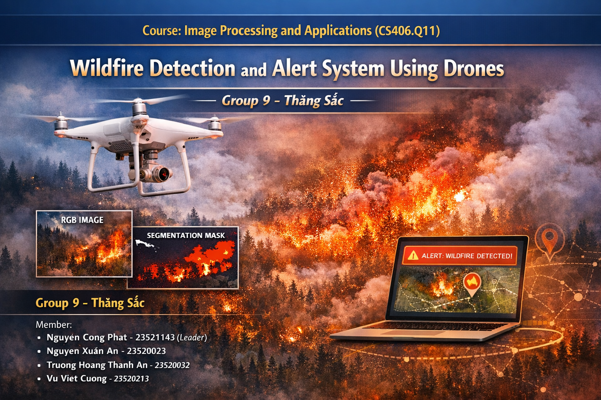

<p align="center">
  <a href="https://www.uit.edu.vn/" title="University of Information Technology">
    
  </a>
</p>

<h1 align="center"><b>CS406.Q11 – Image Processing and Applications</b></h1>

---
# **CS406 Course Project: Wildfire Semantic Segmentation and Alert System for UAVs/Drones via Deep Learning**

> This repository contains the implementation of a **Wildfire Detection and Alert System** based on **semantic segmentation using deep learning**, developed for the course **CS406.Q11 – Image Processing and Applications** at the **University of Information Technology (UIT – VNU-HCM)**.
>
> The project leverages **U-Net–based architectures** trained on the **FLAME Dataset** to detect wildfire regions from aerial imagery captured by drones. In addition to pixel-level fire segmentation, the system incorporates **temporal consistency analysis** and a **rule-based alert mechanism** to trigger wildfire warnings in video streams.


<p align="center">
  
</p>

---

## **Group (ID - Group Name - Team Information):** 9 - Thăng Sắc
| No. | Student ID | Full Name | Role | Github | Email |
|----:|:----------:|-----------|------|--------|-------|
| 1 | 23520032 | Truong Hoang Thanh An | Member | [Awnpz](https://github.com/Awnpz) | 23520032@gm.uit.edu.vn  |
| 2 | 23520023 | Nguyen Xuan An | Member | [annx-uit](https://github.com/annx-uit) |  23520023@gm.uit.edu.vn  | 
| 3 | 23520213 | Vu Viet Cuong | Member | [Kun05-AI](https://github.com/Kun05-AI) |  23520213@gm.uit.edu.vn  | 
| 4 | 23521143 | Nguyen Cong Phat | Leader | [paht2005](https://github.com/paht2005) | 23521143@gm.uit.edu.vn |

---

## **Table of Contents**
- [Features](#features)
- [Dataset](#dataset)
- [Repository Structure](#repository-structure)
- [Methodology](#methodology)
- [Installation](#installation)
- [Usage](#usage)
- [Demo Application](#demo-application)
- [Results](#results)
- [Conclusion](#conclusion)
- [License](#license)

---

## **Features**
- **Wildfire Semantic Segmentation** using U-Net with ResNet encoders.
- **Pixel-level fire mask prediction** from aerial RGB images.
- **Processed FLAME Dataset** with train/validation/test splits.
- **Temporal consistency & persistence analysis** for robust detection.
- **Alert scoring mechanism** based on:
  - Fire area ratio
  - Model confidence
  - Detection persistence across frames
- **Real-time demo interface** using **Gradio** for video-based inference.

---

## **Dataset**
### FLAME Dataset
- **Source**: All evaluations are conducted using the FLAME Dataset, published on IEEE DataPort. Dataset access: [FLAME Dataset on IEEE DataPort](https://ieee-dataport.org/open-access/flame-dataset-aerial-imagery-pile-burn-detection-using-drones-uavs)
- **Original format**:
  - RGB images (`.jpg`)
  - Binary fire masks (`.png`)
- **Dataset structure in this project**:
  - `dataset-raw/`: Original FLAME directory structure.
  - `flame-dataset/`: Processed dataset split into `train / val / test`.
- Images → RGB aerial images
- Masks → Binary wildfire segmentation masks

<p align="center">
  
</p>

---

## **Repository Structure**
```
CS406.Q11_Wildfire-Semantic-Segmentation-and-Alert-System-for-Drones-via-Deep-Learning-Project/
├── dataset-raw/ # Original FLAME dataset structure
│ ├── Images/ # .jpg RGB images
│ └── Masks/ # .png segmentation masks
│
├── flame-dataset/ # Processed dataset (train/val/test)
│ ├── train/
│ │ ├── images/
│ │ └── masks/
│ ├── val/
│ │ ├── images/
│ │ └── masks/
│ └── test/
│ │ ├── images/
│ │ └── masks/
│
├── src/ # Jupyter notebooks (training & evaluation)
│ ├── lightning_logs/ # PyTorch Lightning logs [ignored]
│ ├── split_flame_raw-dataset.ipynb
│ ├── train-models.ipynb
│ └── model-evaluation.ipynb
│
├── models/ # Trained model checkpoints (.ckpt) [ignored]
├── docs/
│ ├── CS406.Q11-Nhom9_slide.pdf
│ └── CS406.Q11-Nhom9_report.pdf
│
├── demo/
│ ├── demo_video.mp4
│ └── demo_gif.gif
│
├── gradio_app.py # Gradio demo application
├── requirements.txt
├── .gitignore
├── LICENSE
├── thumbnail.png
└── README.md

```

## **Methodology**

The system follows a modular pipeline designed through computational thinking principles (Abstraction, Decomposition, and Pattern Recognition) to transform raw sensor data into actionable wildfire alerts.

### **1. Semantic Segmentation Architecture**
- **Core Model**: The system utilizes a **U-Net** architecture, a premier choice for biomedical and environmental image segmentation due to its symmetrical encoder-decoder structure.
- **Encoders**: We implemented **ResNet34** and **ResNet50** backbones to leverage deep residual learning, enhancing feature extraction from complex forest textures.
- **Loss Functions**: To address the class imbalance inherent in wildfire imagery (where fire pixels occupy a small fraction of the frame), we experimented with **Binary Cross-Entropy (BCE)** and a **Composite 3-Loss function** (BCE + Dice Loss + IoU Loss) to optimize both pixel-wise accuracy and region overlap.

### **2. Multi-Modal Feature Recognition**
The model is trained to recognize distinct wildfire patterns across two spectrums:
* **RGB Visual Cues**: Identifying irregular, high-intensity color clusters (red, orange, yellow) and the soft-edged, upward-moving cloud textures characteristic of smoke.
* **Thermal Signatures**: Detecting localized "heat blobs" or saturated spots that represent physical temperature anomalies, allowing the system to filter out visual artifacts like sunlight glare or lens flare.

### **3. Temporal Consistency & Alert Logic**
To ensure high reliability and minimize false positives in live video streams, we implemented a temporal validation loop:
* **Hysteresis Thresholding**: Instead of a single static threshold, the system uses dual-score thresholds:
    * **EVENT_ON ($\ge 0.6$)**: Triggers the **FIRE** state.
    * **EVENT_OFF ($< 0.4$)**: Resets the system to **NO_FIRE**.
* **Persistence Analysis**: A fire alert is only issued if the detection persists across consecutive frames within a 3-second check interval, ensuring that transient glares are ignored.

### **4. Geospatial Localization**
For every detected fire region, the system calculates the geometric centroid of the segmentation mask. By fusing the drone's real-time **GPS coordinates** (latitude, longitude, altitude) with camera orientation metadata (yaw, pitch, roll), the system estimates the ground-truth coordinates of the fire using the **Haversine formula**.

---

## **Installation**

### 1. Clone repository
```bash
git clone https://github.com/paht2005/CS406.Q11_Wildfire-Semantic-Segmentation-and-Alert-System-for-Drones-via-Deep-Learning-Project.git.git
cd CS406.Q11_Wildfire-Semantic-Segmentation-and-Alert-System-for-Drones-via-Deep-Learning-Project
```

### 2. Create virtual environment (recommended)
```bash
python -m venv .venv
source .venv/bin/activate      # Linux / Mac
.venv\Scripts\activate         # Windows
```

### 3. Install dependencies
```bash
pip install -r requirements.txt
```

--- 
## **Usage**
### 1. Training & Research
**Dataset preprocessing:**
```bash
jupyter notebook src/split_flame_raw-dataset.ipynb
```

**Model training:**
```bash
jupyter notebook src/train-models.ipynb
```

**Model evaluation:**
```bash
jupyter notebook src/model-evaluation.ipynb
```

### 2. Running the Demo
- Run the Gradio demo for video-based wildfire detection:
```bash
python gradio_app.py
```
- Open http://localhost in your browser
- Upload a drone video to see results

---
## **Demo Application**
- Run the Gradio demo for video-based wildfire detection:
```bash
python gradio_app.py
```
- Open http://localhost in your browser
- Upload a drone video to see results
- Visualize wildfire segmentation masks
- View alert metadata in real time

A screenshot of the demo interface is available at:

```text
demo/demo_gif.gif
```

<p align="center">
  
</p>


--- 
## **Results**

> Detailed quantitative results will be reported in the final project report.

The system was rigorously evaluated on the **FLAME Dataset** test set. Our experiments focused on the impact of data augmentation and loss function optimization on segmentation precision.

### **Table 1: Comparative Performance Metrics**

| Method | Accuracy | $F_2$-score | IoU | Precision | Recall |
| :--- | :---: | :---: | :---: | :---: | :---: |
| Unet + BCE | 0.9978 | 0.7228 | 0.6396 | 0.8992 | 0.6890 |
| Unet + BCE + Aug | 0.9981 | 0.7672 | 0.6892 | **0.9129** | 0.7377 |
| Unet + 3 Loss | 0.9980 | 0.7740 | 0.6847 | 0.8870 | 0.7501 |
| **Unet + 3 Loss + Aug** | **0.9982** | **0.8162** | **0.7139** | 0.8627 | **0.8054** |


### **Key Performance Insights**
* **Segmentation Quality (IoU)**: The best-performing model (Unet + 3 Loss + Aug) achieved an **Intersection over Union (IoU) of 0.7139**, significantly exceeding our 60% minimum requirement. This ensures that fire boundaries are accurately delineated for emergency responders.
* **Alert Robustness ($F_2$-score)**: We prioritized **Recall** over Precision using the $F_2$-score to ensure no real fires are missed. The system achieved an **$F_2$-score of 0.8162**, surpassing our 75% reliability target.
* **Localization Precision**: Through spatio-temporal tracking, the average geographic error remained under **50 meters**, providing high-fidelity guidance for ground-based containment efforts.


---
## **Conclusion**
This project demonstrates the effectiveness of** deep learning–based semantic segmentation** for early wildfire detection using aerial imagery. 
By combining pixel-level fire segmentation with temporal analysis and alert logic, the system provides a robust foundation for real-time wildfire monitoring using UAVs.

--- 
## **License**
This project is for academic use in the course **CS406.Q11 – Image Processing and Applications** at UIT – VNU-HCM.
This project is licensed under the MIT License. See the [LICENSE](./LICENSE) file for details.
